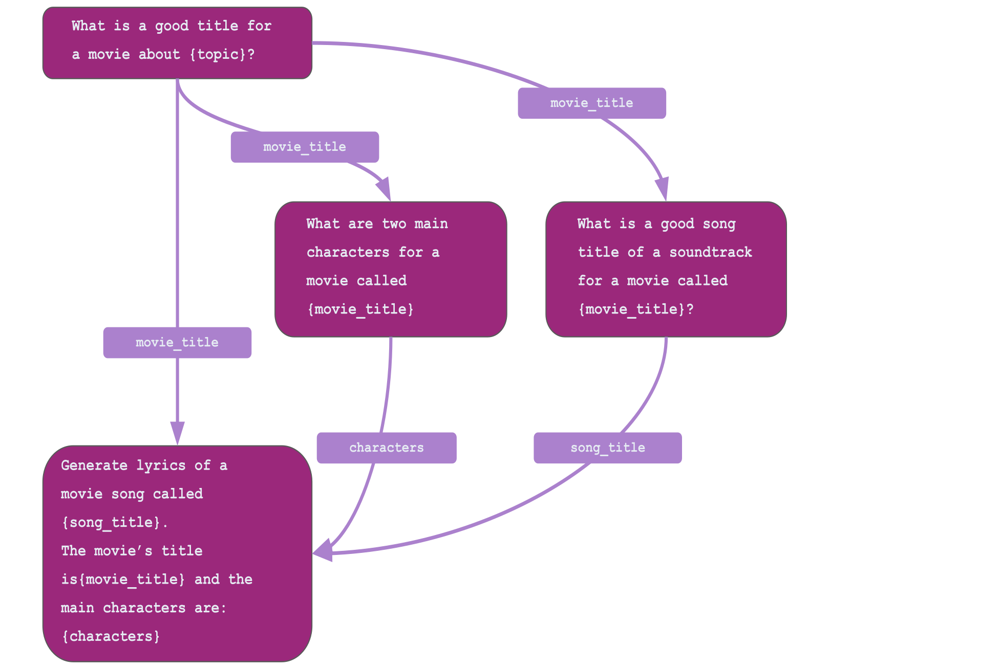

# LLMFlows - Simple, Explicit, and Transparent LLM Apps

<p align="center">
  
</p>

[](https://twitter.com/LLMFlows)


Documentation: [https://readthedocs.org](https://readthedocs.org/)<br/>
PyPI: [https://pypi.org/project/llmflows](https://pypi.org/project/llmflows/)</br>
Twitter: [https://twitter.com/LLMFlows](https://twitter.com/LLMFlows)<br/>
Substack: [https://llmflows.substack.com](https://llmflows.substack.com/)<br/>

## About
LLMFlows is a framework for building simple, explicit, and transparent LLM(Large 
Language Model) applications.

## Installation
```
pip install llmflows
```

## Philosophy

### **Simple**
Our goal is to build a simple, well-documented framework with minimal abstractions that 
allow users to build flexible LLM-powered apps without compromising on capabilities.

### **Explicit**
We want to create an explicit API enabling users to write clean and readable code while 
easily creating complex flows of LLMs interacting with each other. LLMFlows' classes 
give users full control and do not have any hidden prompts or LLM calls. 

### **Transparent**
We aim to help users have full transparency on their LLM-powered apps by providing 
traceable flows and complete information for each app component, making it easy to 
monitor, maintain, and debug.

## Getting Started
### LLMs
LLMs are one of the main abstractions in LLMFlows. LLM classes are wrappers around LLM 
APIs such as OpenAI's APIs. They provide methods for configuring and calling these APIs, 
retrying failed calls, and formatting the responses.

```python
from llmflows.llms import OpenAI

llm = OpenAI(api_key="<your-openai-api-key>")

result, call_data, model_config = llm.generate(
   prompt="Generate a cool title for an 80s rock song"
)
```


### PromptTemplates
The `PromptTemplate` class allows us to create strings with variables that we can fill 
in dynamically later on. Once a prompt template object is created an actual prompt can 
be generated by providing the required variables.

```python
from llmflows.llms import OpenAI
from llmflows.prompts import PromptTemplate


prompt_template = PromptTemplate(
    prompt="Generate a title for a 90s hip-hop song about {topic}."
)
llm_prompt = prompt_template.get_prompt(topic="friendship")

print(llm_prompt)

llm = OpenAI(api_key="<your-openai-api-key>")
song_title = llm.generate(llm_prompt)

print(song_title)
```

### Chat LLMs
Unlike regular LLMs that only require a prompt to generate text, chat LLMs require a 
conversation history. The conversation history is represented 
as a list of messages between a user and an assistant. This conversation history is 
sent to the model, and a new message is generated based on it.

LLMFlows provides a `MessageHistory` class to manage the required conversation history 
for chat LLMs.

You can build a simple chatbot by using the `OpenAIChat` and `MessageHistory` classes:

```python
from llmflows.llms import OpenAIChat, MessageHistory

llm = OpenAIChat(api_key="<your-openai-api-key>")
message_history = MessageHistory()

while True:
    user_message = input("You:")
    message_history.add_user_message(user_message)

    llm_response, call_data, model_config = llm.generate(message_history)
    message_history.add_ai_message(llm_response)

    print(f"LLM: {llm_response}")
```

### LLM Flows
Often times, real-world applications can be more complex and can have dependencies 
between prompts and LLM calls. For example:



When you want to build apps with complex dependencies you can use the `Flow` and 
`Flowstep` classes. LLMFlows will figure out the dependencies and make sure each 
flowstep runs only when all its dependencies are met:

```python
from llmflows.flows import Flow, FlowStep
from llmflows.llms import OpenAI
from llmflows.prompts import PromptTemplate

openai_llm = OpenAI(api_key="<your-openai-api-key>")

# Create prompt templates
title_template = PromptTemplate("What is a good title of a movie about {topic}?")
song_template = PromptTemplate(
    "What is a good song title of a soundtrack for a movie called {movie_title}?"
)
characters_template = PromptTemplate(
    "What are two main characters for a movie called {movie_title}?"
)
lyrics_template = PromptTemplate(
    "Write lyrics of a movie song called {song_title}. The main characters are "
    "{main_characters}"
)

# Create flowsteps
movie_title_flowstep = FlowStep(
    name="Movie Title Flowstep",
    llm=openai_llm,
    prompt_template=title_template,
    output_key="movie_title",
)

song_title_flowstep = FlowStep(
    name="Song Title Flowstep",
    llm=openai_llm,
    prompt_template=song_template,
    output_key="song_title",
)

characters_flowstep = FlowStep(
    name="Characters Flowstep",
    llm=openai_llm,
    prompt_template=characters_template,
    output_key="main_characters",
)

song_lyrics_flowstep = FlowStep(
    name="Song Lyrics Flowstep",
    llm=openai_llm,
    prompt_template=lyrics_template,
    output_key="song_lyrics",
)

# Connect flowsteps
movie_title_flowstep.connect(song_title_flowstep, characters_flowstep, song_lyrics_flowstep)
song_title_flowstep.connect(song_lyrics_flowstep)
characters_flowstep.connect(song_lyrics_flowstep)

# Create and run Flow
soundtrack_flow = Flow(title_flowstep)
results = soundtrack_flow.start(topic="friendship", verbose=True)
```

### Async Flows
Sometimes multiple flow steps can run in parallel if all their dependencies are met. 
For cases like this, LLMFlows provides async classes to improve the runtime of any 
complex flow by running flow steps that already have all their required inputs in 
parallel.

```python

...

movie_title_flowstep = AsyncFlowStep(
    name="Flowstep 1",
    llm=openai_llm,
    prompt_template=title_template,
    output_key="movie_title",
)

song_title_flowstep = FlowStep(
    name="Flowstep 2",
    llm=openai_llm,
    prompt_template=song_template,
    output_key="song_title",
)

characters_flowstep = AsyncFlowStep(
    name="Flowstep 3",
    llm=openai_llm,
    prompt_template=characters_template,
    output_key="main_characters",
)

song_lyrics_flowstep = AsyncFlowStep(
    name="Flowstep 4",
    llm=openai_llm,
    prompt_template=lyrics_template,
    output_key="song_lyrics",
)

...

```

Check our documentation for more examples, such as integrating vector databases, 
creating question-answering apps and web applications with Flask and FastAPI.

## Features

### **LLMs**
- Utilize LLMs such as OpenAI's ChatGPT to generate natural language text.
- Configure LLM classes easily, choosing specific models, parameters, and settings.
- Benefit from automatic retries when model calls fail, ensuring reliable LLM 
  interactions.

### **Prompt Templates**
- Create dynamic prompts using Prompt Templates, providing flexible and customizable 
  text generation.
- Define variables within prompts to generate prompt strings tailored to specific 
  inputs.

### **Flows and FlowSteps**
- Structure LLM applications using Flows and FlowSteps, providing a clear and organized framework for executing LLM interactions.
- Connect flow steps to pass outputs as inputs, facilitating seamless data flow and
    maintaining a transparent LLM pipeline.
- Leverage Async Flows to run LLMs in parallel when all their inputs are available, 
  optimizing performance and efficiency.
- Incorporate custom string manipulation functions directly into flows, allowing 
  specialized text transformations without relying solely on LLM calls.

### **VectorStore Integrations**
- Integrate with vector databases like Pinecone using the VectorStoreFlowStep, 
  empowering efficient and scalable storage and retrieval of vector embeddings.
- Leverage vector databases for seamless storage and querying of vectors, enabling straightforward integration with LLM-powered applications.

### **Callbacks**
- Execute callback functions at different stages within flow steps, enabling enhanced customization, logging, tracing, or other specific integrations.
- Utilize callbacks to comprehensively control and monitor LLM-powered apps, ensuring 
  clear visibility into the execution process.

### **Explicit API and Full Transparency**
With LLMFlows you have the full control to create explicit applications without any hidden prompts or predefined behaviors.

In addition LLMFlows allows you to answer questions such as:

- When was a particular flowstep run?
- How much time did it take?
- What were the input variables?
- What was the prompt template?
- What did the prompt look like?
- What was the exact configuration of the model?
- How many times did we retry the request?
- What was the raw data the API returned?
- How many tokens were used?
- What was the final result?

## License
LLMFlows is covered by the MIT license. For more information, check `LICENCE.md`.

## Contributing
Thank you for spending time going over our README! If you find LLMFlows exciting and 
you are considering contributing, please check [`CONTRIBUTING.md`](https://github.com/stoyan-stoyanov/llmflows/blob/main/CONTRIBUTING.md).
