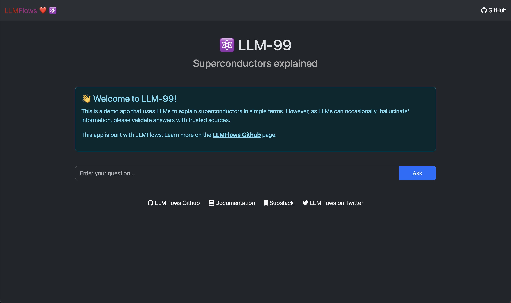

# LLMFlows - Simple, Explicit, and Transparent LLM Apps

<p align="center">
  
</p>
<br/>

[](https://twitter.com/LLMFlows)


***
Source code: [https://github.com/stoyan-stoyanov/llmflows](https://github.com/stoyan-stoyanov/llmflows)<br/>
Twitter: [https://twitter.com/LLMFlows](https://twitter.com/LLMFlows)<br/>
Substack: [https://llmflows.substack.com/](https://llmflows.substack.com/)<br/>
***

## 🤖 About LLM Flows
LLMFlows is a framework for building simple, explicit, and transparent LLM(Large Language Model) applications such as chatbots, question-answering systems, and agents.

At its core, LLMFlows provides a minimalistic set of abstractions that allow you to utilize LLMs and vector stores and build well-structured and explicit apps that don't have hidden prompts or LLM calls. LLM Flows ensures complete transparency for each component, making monitoring, maintenance, and debugging easy. 

## 📦 Installation
```
pip install llmflows
```

## ▶️ Live Demo
Check out [LLM-99](https://llm-99.vercel.app/) - a demo app that uses LLMs to explain 
superconductors in simple terms. The app is built with LLMFlows, and FastAPI and uses 
Pinecone to store document embeddings created from Wikipedia articles. You can find 
the source code for this demo app and other examples in our 
[examples folder](https://github.com/stoyan-stoyanov/llmflows/tree/main/examples/llmflows_in_fastapi/superconductor).

<p align="center">
  
</p>

## 🧪 Getting Started

After installing `llmflows` with `pip`, your go-to destination should be our [User 
Guide](user_guide/Introduction.md). Each page helps new users gradually learn LLMFlow 
starting from simple concepts, going through all main abstractions, and ending with 
complex use cases where LLMFlows shines. 

Each page has a TL;DR code snippet to copy, paste and move on. If you already have 
significant experience with LLMs and prompt engineering, or if you are in a rush, feel 
free to use the TL;DR section and the API reference when needed.

If you are new to LLMs and prompt engineering, feel free to go through the user guide 
in the specified order where you can learn about concepts, abstractions, and patterns 
when creating LLM-powered applications. 

If you have any questions check out our [FAQ](user_guide/FAQ.md) section or feel free to join our 
[Github Discussions](https://github.com/stoyan-stoyanov/llmflows/discussions) page.

We hope you find this documentation helpful and look forward to your feedback on how 
we can improve it.

## 🧭 Philosophy

### Simple
Our goal is to build a simple, well-documented framework with minimal abstractions that 
allow users to build flexible LLM-powered apps without compromising on capabilities.

### Explicit
We want to create an explicit API enabling users to write clean and readable code while 
easily creating complex flows of LLMs interacting with each other. LLMFlows' classes 
give users full control and do not have any hidden prompts or LLM calls. 

### Transparent
We aim to help users have full transparency on their LLM-powered apps by providing 
traceable flows and complete information for each app component, making it easy to 
monitor, maintain, and debug.

## 🛠️ Features

### **LLMs**
- Utilize LLMs such as OpenAI's ChatGPT to generate natural language text.
- Configure LLM classes easily, choosing specific models, parameters, and settings.
- Benefit from automatic retries when model calls fail, ensuring reliable LLM 
  interactions.

### **Prompt Templates**
- Create dynamic prompts using Prompt Templates, providing flexible and customizable 
  text generation.
- Define variables within prompts to generate prompt strings tailored to specific 
  inputs.

### **Flows and FlowSteps**
- Structure LLM applications using Flows and FlowSteps, providing a clear and organized framework for executing LLM interactions.
- Connect flow steps to pass outputs as inputs, facilitating seamless data flow and
    maintaining a transparent LLM pipeline.
- Leverage Async Flows to run LLMs in parallel when all their inputs are available, 
  optimizing performance and efficiency.
- Incorporate custom string manipulation functions directly into flows, allowing 
  specialized text transformations without relying solely on LLM calls.

### **VectorStore Integrations**
- Integrate with vector databases like Pinecone using the VectorStoreFlowStep, 
  empowering efficient and scalable storage and retrieval of vector embeddings.
- Leverage vector databases for seamless storage and querying of vectors, enabling straightforward integration with LLM-powered applications.

### **Callbacks**
- Execute callback functions at different stages within flow steps, enabling enhanced customization, logging, tracing, or other specific integrations.
- Utilize callbacks to comprehensively control and monitor LLM-powered apps, ensuring 
  clear visibility into the execution process.

### **Explicit API and Full Transparency**
With LLMFlows you have the full control to create explicit applications without any hidden prompts or predefined behaviors.

In addition LLMFlows allows you to answer questions such as:

- When was a particular flowstep run?
- How much time did it take?
- What were the input variables?
- What was the prompt template?
- What did the prompt look like?
- What was the exact configuration of the model?
- How many times did we retry the request?
- What was the raw data the API returned?
- How many tokens were used?
- What was the final result?


## 📃 License
LLMFlows is covered by the MIT license. For more information, check 
[`LICENCE`](https://github.com/stoyan-stoyanov/llmflows/blob/main/LICENSE).

## ❤️ How you can help?
If you like the project please consider giving it a star, sharing it with friends or on social media.

If you've tried LLMFlows and have some issues, feedback or ideas feel free to open an issue or reach out!

If you find LLMFlows exciting and you are considering contributing, please check [`CONTRIBUTING.md`](https://github.com/stoyan-stoyanov/llmflows/blob/main/CONTRIBUTING.md).