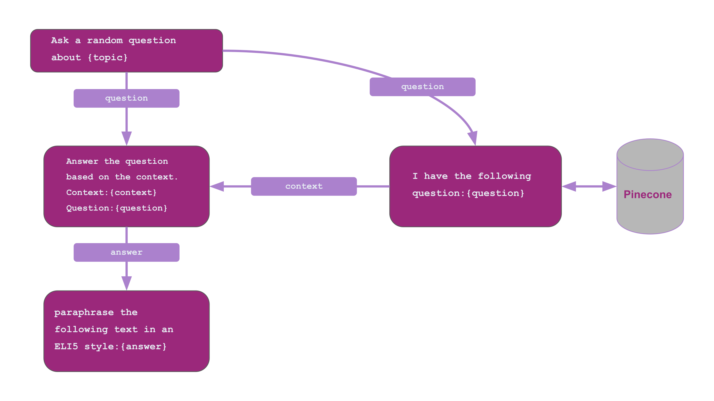

## TL;DR

```python
import os
from llmflows.flows import Flow, FlowStep, VectorStoreFlowStep
from llmflows.llms import OpenAI, OpenAIEmbeddings
from llmflows.prompts import PromptTemplate
from llmflows.vectorstores import Pinecone


vector_db = Pinecone(
    index_name="llmflows-tutorial",
    api_key=os.environ.get("PINECONE_API_KEY", "<YOUR-API-KEY>"),
    environment="us-west4-gcp-free",
)

# Create prompt templates
question_template = PromptTemplate("Ask a random question about {topic}")
vs_template = PromptTemplate("I have the following question: {question}")
response_template = PromptTemplate(
    "Answer the question based on the context.\n"
    "Context:\n"
    "{context}\n"
    "Question:\n"
    "{question}"
)
eli5_template = PromptTemplate(
    "paraphrase the following text in an ELI5 style:\n{response}"
)

# Create flowsteps
q_flowstep = FlowStep(
    name="Question Flowstep",
    llm=OpenAI(),
    prompt_template=question_template,
    output_key="question",
)

vs_flowstep = VectorStoreFlowStep(
    name="Vectorstore Flowstep",
    embeddings_model=OpenAIEmbeddings(),
    vector_store=vector_db,
    prompt_template=vs_template,
    output_key="context",
)

answer_flowstep = FlowStep(
    name="Response Flowstep",
    llm=OpenAI(),
    prompt_template=response_template,
    output_key="response",
)

eli5_flowstep = FlowStep(
    name="ELI5 Flowstep",
    llm=OpenAI(),
    prompt_template=eli5_template,
    output_key="eli5_response",
)

# Connect flowsteps
q_flowstep.connect(vs_flowstep, answer_flowstep)
vs_flowstep.connect(answer_flowstep)
answer_flowstep.connect(eli5_flowstep)

# Create and run Flow
qa_flow = Flow(q_flowstep)
results = qa_flow.execute(topic="wormholes", verbose=True)
print(results)

```
***
## Guide
!!! warning
    Before starting this guide you will need to complete the [Vector Stores](Vector Databases.md) guide and upsert the VectorDocs based on the Wikipedia texts into Pinecone.

In the previous two guides we saw how we can create vector embeddings for text documents, upload it to a vector database, and then use it for question answering.
In this guide we will look into creating a question answering flow by utlizing the `VectorStoreFlowstep` class. We will try to achieve the same results as in the previous guide but we will try to add one more step in the end to paraphrase the complex physics response in an ELI5 style:



Let's utilize the good old pattern for creating flows:

1. create a mental picture of the flow
2. create the prompt templates
3. create flowsteps
4. connect flowsteps
5. run the flow

Here are the prompt templates that we are going to need:
```python
from llmflows.prompts import PromptTemplate

question_template = PromptTemplate("Ask a random question about {topic}")
vs_template = PromptTemplate("I have the following question: {question}")
response_template = PromptTemplate(
    "Answer the question based on the context.\n"
    "Context:\n"
    "{context}\n"
    "Question:\n"
    "{question}"
)
eli5_template = PromptTemplate(
    "paraphrase the following text in an ELI5 style:\n{response}"
)
```

Now let's create the flowsteps based on the figure above. In order to add a vector store we can utilize the `VectorStoreFlowStep` class which requires an embedding model, a vector database client, and a prompt template.
```python
from llmflows.flows import Flow, FlowStep, VectorStoreFlowStep
from llmflows.llms import OpenAI, OpenAIEmbeddings

vector_db = Pinecone(
    index_name="llmflows-tutorial",
    api_key=os.environ.get("PINECONE_API_KEY", "<YOUR-API-KEY>"),
    environment="us-west4-gcp-free",
)

q_flowstep = FlowStep(
    name="Question Flowstep",
    llm=OpenAI(),
    prompt_template=question_template,
    output_key="question",
)

vs_flowstep = VectorStoreFlowStep(
    name="Vectorstore Flowstep",
    embeddings_model=OpenAIEmbeddings(),
    vector_store=vector_db,
    prompt_template=vs_template,
    output_key="context",
)

answer_flowstep = FlowStep(
    name="Response Flowstep",
    llm=OpenAI(),
    prompt_template=response_template,
    output_key="response",
)

eli5_flowstep = FlowStep(
    name="ELI5 Flowstep",
    llm=OpenAI(),
    prompt_template=eli5_template,
    output_key="eli5_response",
)
```
Now we can connect the flowsteps:
```python
q_flowstep.connect(vs_flowstep, answer_flowstep)
vs_flowstep.connect(answer_flowstep)
answer_flowstep.connect(eli5_flowstep)
```

And finally we can create the flow and run it:
```
qa_flow = Flow(q_flowstep)
results = qa_flow.execute(topic="wormholes", verbose=True)
print(results)
```


***
[:material-arrow-left: Previous: Question Answering](Question Answering.md){ .md-button }