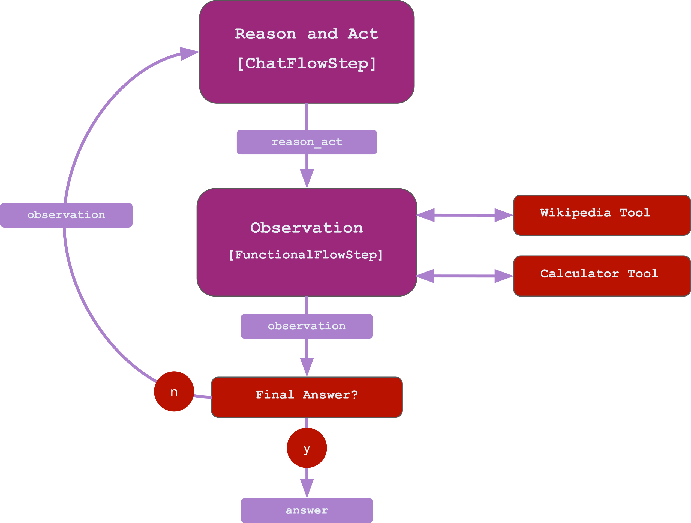

## TL;DR

You can find the [complete example](https://github.com/stoyan-stoyanov/llmflows/tree/main/examples/react_agent) on Github.

## Guide
The concept of LLM-powered agents became very popular after the release of GPT-4. 
Agents are programs that include one or multiple LLMs that can invoke traditional 
functions (often called tools).

LLMs gain the ability to utilize tools by being forced to generate specific text 
through prompts that list the available tools and provide examples of how 
to use them.

For example:

```python
system_prompt = """
You are a 150IQ assistant that answers questions.
To answer the questions you have access to the following tools:
- search
- calculator

You can use tools in the following way:
search: [Who is Albert Einsten?]
calculator: [2 + 3]
"""
```

Every time the LLM generates text based on the rules above, we can parse the text to 
extract the function name and the function argument (e.g., "search" and "Who is Albert 
Einstein?) and invoke the respective function. Then we can evaluate the result of the 
function and even add it to the conversation history, so the LLM can use it the next 
time it generates text.

One popular agent architecture is the <a href="https://arxiv.org/abs/2210.03629" target="_blank">ReAct architecture</a>. 
In this paradigm, the agent runs in a loop of reasoning, acting, and observing the 
action outcome to solve a problem:

1. The agent starts by reasoning how it can solve the appointed task. 
2. Afterward, it specifies an action based on the reasoning. 
3. The agent invokes a function corresponding to the action and the result makes up the observation.
4. Once it has the observation, the agent starts the reasoning phase again, and the 
loop continues until the agent decides it has all the required information and generates a final answer.

Example:
```commandline
Question: What is the elevation range for the area that the eastern sector of the 
Colorado orogeny extends into?
---
Thought: I need to search Colorado orogeny, find the area that the eastern sector of 
the Colorado orogeny extends into, then find the elevation range of the area.
---
Action: wikipedia: Colorado orogeny
---
Observation: The Colorado orogeny was an episode of mountain building (an orogeny) in 
Colorado and surrounding areas.
---
Thought: It does not mention the eastern sector. So I need to look up eastern sector.
---
Action: wikipedia: eastern sector
---
Observation: (Result 1 / 1) The eastern sector extends into the High Plains and is 
called the Central Plains orogeny.
---
Thought: The eastern sector of Colorado orogeny extends into the High Plains. So I need 
to search High Plains and find its elevation range.
---
Action: wikipedia: High Plains
---
Observation: High Plains refers to one of two distinct land regions
---
Thought: I need to instead search High Plains (United States).
---
Action: wikipedia: High Plains (United States)
---
Observation: The High Plains are a subregion of the Great Plains. From east to west, 
the High Plains rise in elevation from around 1,800 to 7,000 ft (550 to 2,130 m).[3] 
Thought: High Plains rise in elevation from around 1,800 to 7,000 ft, so the answer 
is 1,800 to 7,000 ft.
---
Action: final answer: 1,800 to 7,000 ft,
```

Let's build a simple version of this agent. To keep things tidy, we will create three separate files:

- `tools.py`, where we will define the tool functions.
- `prompts.py` to store all the prompts
- `agent.py`, where we will implement the agent flow.


We will start by specifying the tools it will have access to. To keep it simple, let's begin by creating two tools in `tools.py` - a calculator and a Wikipedia search tool.

```python
def calculator_tool(calc):
    """ 
    A simple calculator tool that uses eval() to calculate the result of a given 
    expression. 
    """
    return "Observation: the calculation result is " + str(eval(calc))
```
The calculator tool is just a simple function that gets a string representing an expression and then returns 
the observation with the result of the expression.

Here is also the code for the Wikipedia tool:

```python
from mediawiki import MediaWiki

wikipedia = MediaWiki()

def wikipedia_tool(query: str) -> str:
    """
    Retrieves the summary of a Wikipedia article for a given query.

    Args:
        query: A string representing the title of a Wikipedia article.

    Returns:
        A string representing the summary of the article, or a preset string if the 
        article was not found.
    """
    try:
        wikipedia_page = wikipedia.page(query)
        return f"Observation: {wikipedia_page.summary}"
    except:
        return "Observation: The search didn't return any data"
```

This function uses the <a href="https://github.com/barrust/mediawiki" target="_blank">`pymediawiki`</a> package to get the summary of a Wikipedia article. The exact details are out of the scope of this guide, but you can read more about the package if you follow the link above. 

!!! info

    To run this function, you will need to install the `pymediawiki` package:
    ```
    pip install pymediawiki
    ```

Great! Now we have two tools that our agent can use. Let's move to the exciting part - building the actual agent.

In LLM Flows, an agent is just a flow that runs in a loop. We can implement the ReAct architecture by defining two flow steps.
We can use the `ChatFlowStep` and the `OpenAIChat` LLM to generate a thought and an action. 
Once we have the thought and action, we can invoke the correct function. We can do that by creating `FunctionalFlowStep`, which will use the `tool_selector` to call a function based on the content the agent produced in the first flowstep. Finally, once we get the result(observation) from the function, we can evaluate it and pass it back for the next step or finish the loop if it contains the final answer.

Here is what the whole agent loop looks like:




For the first step, we will use the `OpenAIChat` LLM, which supports a system prompt. We can use the system prompt to specify the behavior of the agent.
Let's specify a system prompt in `prompts.py`.

```python
system_prompt = """
You are a 125IQ AI Assistant that answers questions by using tools. You run in a loop of Thoughts, Actions, and Observations.
You always start with a Thought and action. 
At the end of the loop you output an Answer
Use Thought to describe your thoughts about the question you have been asked.
Use Action to run one of the actions available to you - then return PAUSE.
Observation will be the result of running those actions.

Your available actions are:

calculator:
e.g. calculator: (5 * 3) + 1
A calculator that accepts a python expression and returns the result of the calculation.

wikipedia:
e.g. wikipedia: Jimmy Hendrix
Searches wikipedia and returns a summary

Examples:
---
Question: What is the elevation range for the area that the eastern sector of the Colorado orogeny extends into?
Thought: I need to search Colorado orogeny, find the area that the eastern sector of the Colorado orogeny extends into, then find the elevation range of the area.
Action: wikipedia: Colorado orogeny
Observation: The Colorado orogeny was an episode of mountain building (an orogeny) in Colorado and surrounding areas. [not written by you]
Thought: It does not mention the eastern sector. So I need to look up eastern sector.
Action: wikipedia: eastern sector
Observation: (Result 1 / 1) The eastern sector extends into the High Plains and is called the Central Plains orogeny. [not written by you]
Thought: The eastern sector of Colorado orogeny extends into the High Plains. So I need to search High Plains and find its elevation range.
Action: wikipedia: High Plains
Observation: High Plains refers to one of two distinct land regions [not written by you]
Thought: I need to instead search High Plains (United States).
Action: wikipedia: High Plains (United States)
Observation: The High Plains are a subregion of the Great Plains. From east to west, the High Plains rise in elevation from around 1,800 to 7,000 ft (550 to 2,130 m).[3] [not written by you]
Thought: High Plains rise in elevation from around 1,800 to 7,000 ft, so the answer is 1,800 to 7,000 ft.
Action: final answer: 1,800 to 7,000 ft,
---
Question: Which documentary is about Finnish rock groups, Adam Clayton Powell or The Saimaa Gesture?
Thought: I need to search Adam Clayton Powell and The Saimaa Gesture, and find which documentary is about Finnish rock groups.
Action: wikipedia: Adam Clayton Powell
Observation: Could not find [Adam Clayton Powell]. Similar: [’Adam Clayton Powell III’, ’Seventh Avenue (Manhattan)’, ’Adam Clayton Powell Jr. State Office Building’, ’Isabel Washington Powell’, ’Adam Powell’, ’Adam Clayton Powell (film)’, ’Giancarlo Esposito’].
Thought: To find the documentary, I can search Adam Clayton Powell (film).
Action: wikipedia: Adam Clayton Powell (film)]
Observation: Adam Clayton Powell is a 1989 American documentary film directed by Richard Kilberg. The film is about the rise and fall of influential African-American politician Adam Clayton Powell Jr.[3][4] It was later aired as part of the PBS series The American Experience.
Thought: Adam Clayton Powell (film) is a documentary about an African-American politician, not Finnish rock groups. So the documentary about Finnish rock groups must instead be The Saimaa Gesture.
Action: final answer: The Saimaa Gesture
---

Rules:
- Stop writing after specifying an action;
- You never write the observations - observations are provided to you by the tools;
- Always write a thought after an observation;
- Always write an action after a thought;
"""
```

In short, here is what the `system_prompt` contains:

1. We start by specifying the behavior and describe the ReAct architecture - explaining 
 that the agent uses thoughts, actions, and observations to solve a problem
1. We described the two tools - wikipedia search and calculator, and we explained how the agents can invoke it
2. We continue by providing two example sessions so we can utilize the in-context learning capabilities of the LLMs
3. We finish by specifying some rules to make sure the produced text is consistent with the ReAct architecture

All chat LLMs require message history, so let's define it and include the system prompt:

```python
message_history = MessageHistory()
message_history.system_prompt = system_prompt
```

In addition to the system prompt, we need to create a message prompt that will pass the question the agent needs to answer and the reasoning history from the previous step.

In `prompts.py`:
```python
react_prompt_template = PromptTemplate("Question: {question}\n{react_history}")
```

Now we can create the "Reason + Act Flowstep":
```python
# Create flowsteps
thought_action = ChatFlowStep(
    name="Thought + Action Step",
    llm=OpenAIChat(api_key=open_ai_key, model="gpt-4"),
    message_history=message_history,
    message_prompt_template=react_prompt_template,
    message_key="question",
    output_key=f"thought_action",
)

```

!!! info

    Please note that we are using `gpt-4` as a model for the ChatLLM since agents 
    perform very poorly with the `gpt-3.5` family of models.

Our next stop is the "Observation" flowstep. In this flowstep, we will use the output of the previous step to invoke the right tool that the agent wants to use.
To do that, we can use the `FunctionalFlowStep` and pass a function that will parse the previous output based on the specifications in the `system_prompt`.

In `tools.py`:
```python
def tool_selector(thought_action: str) -> str:
    """Invokes a tool based on the action specified in the agent output"""
    if "final answer:" in thought_action:
        return "<final_answer>"
    elif "wikipedia:" in thought_action:
        print("Using wikipedia tool:")
        question = thought_action.split("wikipedia:")[1].strip()
        return wikipedia_tool(question)
    elif "calculator" in thought_action:
        print("Using calculator tool:")
        calc = thought_action.split("calculator:")[1].strip()
        return calculator_tool(calc)

    else:
        return "<invalid_action>"
```

We can now pass this to the `FunctionalFlowStep` and create the flow:

```python

observation = FunctionalFlowStep(
    name="Observation Step",
    flowstep_fn=tool_selector,
    output_key="observation",
)

# Connect flowsteps
thought_action.connect(observation)

# Create the flow
react_agent_flow = Flow(thought_action)
```

Finally, we can create the agent loop. 
```python
problem = "What is the age difference between Barak Obama and Michelle Obama?"
max_steps = 10
react_history = ""

for i in range(max_steps):
    result = react_agent_flow.start(
        question=problem, react_history=react_history, verbose=True
    )

    if result["Observation Step"]["generated"] == "<final_answer>":
        break
    else:
        # add the thought, action and observations from this flow to the history
        react_history += (
            result["Thought + Action Step"]["generated"]
            + result["Observation Step"]["generated"]
            + "\n"
        )
```

We start by specifying the question we want the agent to answer and empty reasoning history.
We also want to define `max_steps` parameters if our agent decides to go rogue\s.

Here is what is happening in our loop:

1. Run the flow which produces thought, action, and observation
2. Evaluate the observation.
3. If the observation is not the final answer, update the reasoning history and run the flow again
4. If the observation is final, break the loop.

We are ready to run our agent! Let's start it and see what happens!

```commandline
Thought + Action Step:
Thought: To answer this question, I need the birth dates of both Barack Obama and his wife, Michelle Obama. I'll start with Barack's birth date.
Action: wikipedia: Barack Obama

Using wikipedia tool:
Observation Step:
Observation: Barack Hussein Obama II ( (listen) bə-RAHK hoo-SAYN oh-BAH-mə; born August 4, 1961) is an American politician who served as the 44th president of the United States from 2009 to 2017. A member of the Democratic Party, he was the first African-American  president of the United States. Obama previously served as a U.S. senator representing Illinois from 2005 to 2008 and as an Illinois state senator from 1997 to 2004, and worked as a civil rights lawyer and university lecturer. Obama was born in Honolulu, Hawaii. After graduating from Columbia University in 1983, he worked as a community organizer in Chicago.

Thought + Action Step:
Thought: Barack Obama was born on August 4, 1961. Now I need to find out when Michelle Obama was born.
Action: wikipedia: Michelle Obama

Using wikipedia tool:
Observation Step:
Observation: Michelle LaVaughn Robinson Obama (born January 17, 1964) is an American attorney and author who served as the first lady of the United States from 2009 to 2017, being married to former president Barack Obama.  Raised on the South Side of Chicago, Obama is a graduate of Princeton University and Harvard Law School. In her early legal career, she worked at the law firm Sidley Austin where she met Barack Obama. She subsequently worked in nonprofits and as the associate dean of Student Services at the University of Chicago as well as the vice president for Community and External Affairs of the University of Chicago Medical Center. Michelle married Barack in 1992, and together they have two daughters.

Thought + Action Step:
Thought: Michelle Obama was born on January 17, 1964. Now that I have both birth dates, I can calculate the age difference.
Action: calculator: (1964 - 1961) * 12 + (1 - 8)

Using calculator tool:
Observation Step:
Observation: the calculation result is 29

Thought + Action Step:
Thought: The age difference between Barack and Michelle Obama is 29 months, which is approximately 2.42 years.
Action: final answer: The age difference between Barack and Michelle Obama is approximately 2.42 years.

Observation Step:
<final_answer>
```

Isn't this exciting? The agent even decided to not only return the difference in years but to 
go for a more complex calculation and include the months they were born. 

What is even better is that our `results` contain all the information you need to figure 
out what happened at each step, making our agent as transparent as possible and easy to debug!

***
[:material-arrow-left: Previous: LLMFlows with FastAPI](LLMFlows with FastAPI.md){ .md-button }
[Next: Conclusion :material-arrow-right:](Conclusion.md){ .md-button }