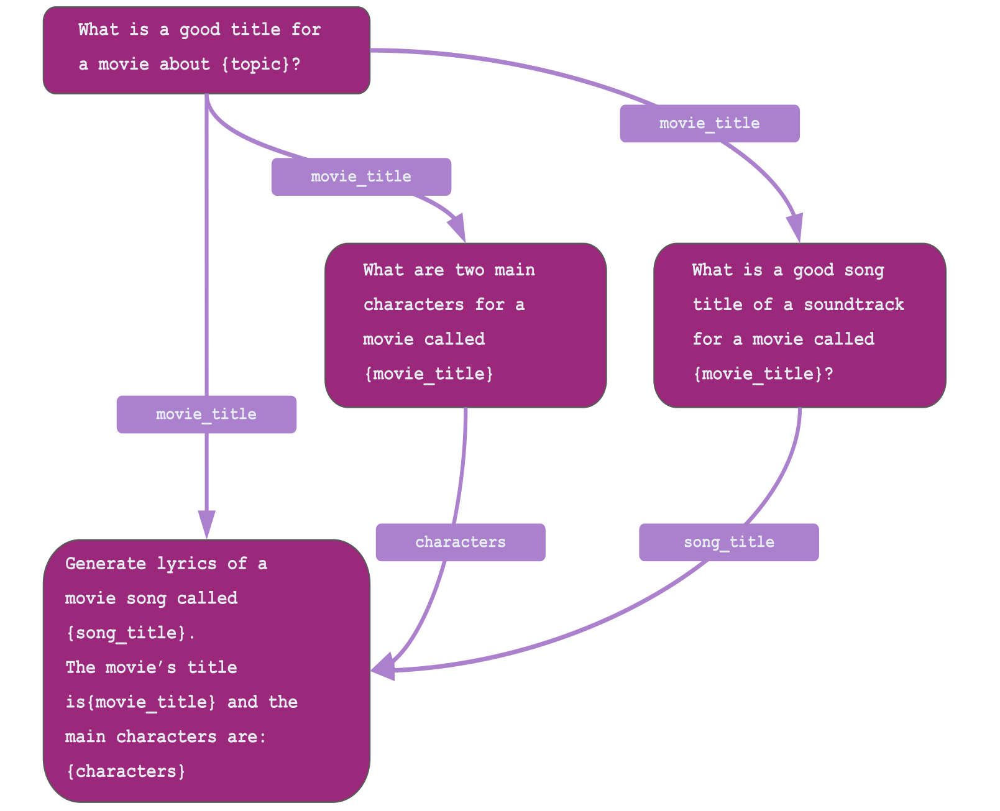

## TL;DR

```python
from llmflows.flows import Flow, FlowStep
from llmflows.llms import OpenAI
from llmflows.prompts import PromptTemplate

# Create prompt templates
title_template = PromptTemplate("What is a good title of a movie about {topic}?")
song_template = PromptTemplate(
    "What is a good song title of a soundtrack for a movie called {movie_title}?"
)
characters_template = PromptTemplate(
    "What are two main characters for a movie called {movie_title}?"
)
lyrics_template = PromptTemplate(
    "Write lyrics of a movie song called {song_title}. The main characters are"
    " {main_characters}"
)

# Create flowsteps
flowstep1 = FlowStep(
    name="Movie Title Flowstep",
    llm=OpenAI(),
    prompt_template=title_template,
    output_key="movie_title",
)

flowstep2 = FlowStep(
    name="Song Title Flowstep",
    llm=OpenAI(),
    prompt_template=song_template,
    output_key="song_title",
)

flowstep3 = FlowStep(
    name="Characters Flowstep",
    llm=OpenAI(),
    prompt_template=characters_template,
    output_key="main_characters",
)

flowstep4 = FlowStep(
    name="Lyrics Flowstep",
    llm=OpenAI(),
    prompt_template=lyrics_template,
    output_key="song_lyrics",
)

# Connect flowsteps
flowstep1.connect(flowstep2, flowstep3, flowstep4)
flowstep2.connect(flowstep4)
flowstep3.connect(flowstep4)

# Create and run Flow
soundtrack_flow = Flow(flowstep1)
results = soundtrack_flow.execute(topic="friendship", verbose=True)
print(results)

```
***
## Guide
In the Introduction section we covered the Flow and FlowStep abstractions and we saw how we can create explicit, and transparent 
LLM Flows to build LLM-powered apps. In this guide we will dive a bit deeper and will build a slightly more complex example.

Let's imagine that for some reason you want to create an app that can generate a movie title, a movie song title based on the movie title, write a summary 
for the two main characters of the movie and finally create song lyrics based on movie title, song title, and the two characters.

Here is a visual representation of a flow that can help us do that:



Let's start by defining the prompt templates:

```python
from llmflows.prompts import PromptTemplate

title_template = PromptTemplate("What is a good title of a movie about {topic}?")
song_template = PromptTemplate(
    "What is a good song title of a soundtrack for a movie called {movie_title}?"
)
characters_template = PromptTemplate(
    "What are two main characters for a movie called {movie_title}?"
)
lyrics_template = PromptTemplate(
    "Write lyrics of a movie song called {song_title}. The main characters are"
    " {main_characters}"
)
```

Now we can create the four flowsteps:
```python
from llmflows.flows import Flow, FlowStep

flowstep1 = FlowStep(
    name="Movie Title Flowstep",
    llm=OpenAI(),
    prompt_template=title_template,
    output_key="movie_title",
)

flowstep2 = FlowStep(
    name="Song Title Flowstep",
    llm=OpenAI(),
    prompt_template=song_template,
    output_key="song_title",
)

flowstep3 = FlowStep(
    name="Characters Flowstep",
    llm=OpenAI(),
    prompt_template=characters_template,
    output_key="main_characters",
)

flowstep4 = FlowStep(
    name="Lyrics Flowstep",
    llm=OpenAI(),
    prompt_template=lyrics_template,
    output_key="song_lyrics",
)

```

Once we have defined the flowsteps we can connect them to create the flow from the figure above:
```python
flowstep1.connect(flowstep2, flowstep3, flowstep4)
flowstep2.connect(flowstep4)
flowstep3.connect(flowstep4)
```

Finally, we can create the Flow object and execute the flow:
```python
soundtrack_flow = Flow(flowstep1)
results = soundtrack_flow.execute(topic="friendship", verbose=True)
```

And Voilà! We managed to create a complex flow pretty much as easy as the basic example from the previous guide. 
LLMFlows will figure out the dependencies, and execute the flow in the right order - making sure that all the inputs are available before executing a given flowstep. 

In fact, you might have already noticed that there is an emerging pattern:

1. create a mental picture of the flow
2. create the prompt templates
3. create flowsteps
4. connect flowsteps
5. run the flow

By following this pattern you can create any flow with any level of complexity as long as you can represent it as a DAG.

In our next guide we will create a flow that can be optimized for total runtime by executing 
flowsteps that already have all their required inputs in parallel.

***
[:material-arrow-left: Previous: Introduction](Introduction.md){ .md-button }
[Next: Async Flows :material-arrow-right:](Async Flows.md){ .md-button }
