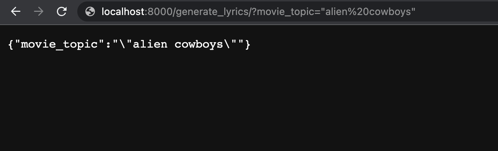
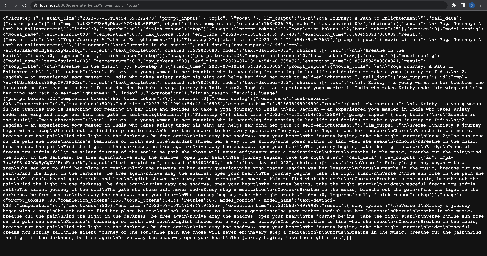

## TL;DR

You can find the [complete example]() on Github.

`flows.py`
```python
from llmflows.flows import AsyncFlow, AsyncFlowStep
from llmflows.llms import OpenAI
from llmflows.prompts import PromptTemplate


openai_api_key = os.environ.get("OPENAI_API_KEY", "<your-api-key>")

def create_flow():
    flowstep1 = AsyncFlowStep(
        name="Flowstep 1",
        llm=OpenAI(api_key=openai_api_key),
        prompt_template=PromptTemplate("What is a good title of a movie about {topic}?"),
        output_key="movie_title",
    )

    flowstep2 = AsyncFlowStep(
        name="Flowstep 2",
        llm=OpenAI(api_key=openai_api_key),
        prompt_template=PromptTemplate(
            "What is a good song title of a soundtrack for a movie called {movie_title}?"
        ),
        output_key="song_title",
    )

    flowstep3 = AsyncFlowStep(
        name="Flowstep 3",
        llm=OpenAI(api_key=openai_api_key),
        prompt_template=PromptTemplate(
            "What are two main characters for a movie called {movie_title}?"
        ),
        output_key="main_characters",
    )

    flowstep4 = AsyncFlowStep(
        name="Flowstep 4",
        llm=OpenAI(api_key=openai_api_key),
        prompt_template=PromptTemplate(
            "Write lyrics of a movie song called {song_title}. The main characters are"
            " {main_characters}"
        ),
        output_key="song_lyrics",
    )

    # Connect flowsteps
    flowstep1.connect(flowstep2, flowstep3, flowstep4)
    flowstep2.connect(flowstep4)
    flowstep3.connect(flowstep4)

    soundtrack_flow = AsyncFlow(flowstep1)

    return soundtrack_flow

```

`app.py`

```python
from fastapi import FastAPI
import uvicorn
from flows import create_flow

app = FastAPI()

@app.get("/generate_lyrics/")
async def generate_lyrics(movie_topic: str):
    soundtrack_flow = create_flow()
    return await soundtrack_flow.start(topic=movie_topic, verbose=True)

if __name__ == "__main__":
    uvicorn.run(app, host="0.0.0.0", port=8000)

```

## Guide
In this guide, we are going to see how we can create a simple fastaAPI app and use 
LLMFlows to build a LLM-powered web app.

Let's start by creating our fastAPI app. For this, we need to install `fastapi` and 
`uvicorn`.

```
pip install fastapi uvicorn
```

let's create our `app.py`:

```python
from fastapi import FastAPI
import uvicorn

app = FastAPI()

@app.get("/generate_lyrics/")
async def generate_lyrics(movie_topic: str):
    return {"movie_topic": movie_topic}

if __name__ == "__main__":
    uvicorn.run(app, host="0.0.0.0", port=8000)
```

Let's run the app and see what happens:

```commandline
python3 app.py
```

```commandline
INFO:     Started server process [31938]
INFO:     Waiting for application startup.
INFO:     Application startup complete.
INFO:     Uvicorn running on http://0.0.0.0:8000 (Press CTRL+C to quit)
```

It's looking good! Our app is running.

Let's check what happens when we open it in the browser:

```
http://localhost:8000/generate_lyrics/?movie_topic=alien cowboys
```



So far, so good! We made a simple fastAPI app with just a few lines of code, and it can 
return our query parameter. 
Now let's include LLMFlow. Let's create a `flow.py` file in the same directory. FastAPI 
works great with async functions, so let's reuse our async flow example from our 
previous guides. To make sure we use a new flow on each call, let's create a 
`create_flow()` function in `flow.py`:


```python
from llmflows.flows import AsyncFlow, AsyncFlowStep
from llmflows.llms import OpenAI
from llmflows.prompts import PromptTemplate


openai_api_key = os.environ.get("OPENAI_API_KEY", "<your-api-key>")

def create_flow():
    flowstep1 = AsyncFlowStep(
        name="Flowstep 1",
        llm=OpenAI(api_key=openai_api_key),
        prompt_template=PromptTemplate("What is a good title of a movie about {topic}?"),
        output_key="movie_title",
    )

    flowstep2 = AsyncFlowStep(
        name="Flowstep 2",
        llm=OpenAI(api_key=openai_api_key),
        prompt_template=PromptTemplate(
            "What is a good song title of a soundtrack for a movie called {movie_title}?"
        ),
        output_key="song_title",
    )

    flowstep3 = AsyncFlowStep(
        name="Flowstep 3",
        llm=OpenAI(api_key=openai_api_key),
        prompt_template=PromptTemplate(
            "What are two main characters for a movie called {movie_title}?"
        ),
        output_key="main_characters",
    )

    flowstep4 = AsyncFlowStep(
        name="Flowstep 4",
        llm=OpenAI(api_key=openai_api_key),
        prompt_template=PromptTemplate(
            "Write lyrics of a movie song called {song_title}. The main characters are"
            " {main_characters}"
        ),
        output_key="song_lyrics",
    )

    # Connect flowsteps
    flowstep1.connect(flowstep2, flowstep3, flowstep4)
    flowstep2.connect(flowstep4)
    flowstep3.connect(flowstep4)

    soundtrack_flow = AsyncFlow(flowstep1)

    return soundtrack_flow
```

Now we can import `create_flow()` in `app.py`. Here is what the final code looks like:

```python
from fastapi import FastAPI
import uvicorn
from flows import create_flow

app = FastAPI()

@app.get("/generate_lyrics/")
async def generate_lyrics(movie_topic: str):
    soundtrack_flow = create_flow()
    return await soundtrack_flow.start(topic=movie_topic, verbose=True)

if __name__ == "__main__":
    uvicorn.run(app, host="0.0.0.0", port=8000)
```

We've defined the `movie_topic` query parameter, and when we add it to the url, it 
will be used as input to our `soundtrack_flow`. 
Let's rerun the app and see what happens. 

```commandline
python3 app.py
```
Now we can go to the browser and try to generate the song lyrics of a movie about 
"yoga":

```
http://localhost:8000/generate_lyrics/?movie_topic=yoga
```



This is a handful!

The `AsyncFlow` returned the final result and detailed runtime information for each 
flowstep. In addition, `flowtep3` and `flowstep4` ran in parallel thanks to the async 
implementation.

***
[:material-arrow-left: Previous: Callbacks](Callbacks.md){ .md-button }
[Next: Agents :material-arrow-right:](Agents.md){ .md-button }